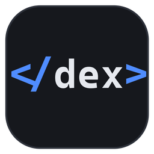

# Dex

**One window, several Claude Code agents, and a shared memory between them.**

Dex is a Windows terminal workspace for multi-agent coding. You open a workspace per project, split it into panes, and run a Claude Code agent in each. Dex watches what every agent does, shows you their status at a glance, tells you when one needs you, and gives the agents a place to leave notes for each other — so four agents working on one codebase stop solving the same problem four times.

An agent in Dex can also start another agent: on its own task, in its own pane, in its own git worktree, and it gets to work without anyone typing anything.

---

## What it's for

You have a job that's bigger than one agent should do alone, or several jobs at once against the same repository:

- **Parallel work on one codebase.** Port the API in one pane, write its tests in another, update the docs in a third — each agent in its own worktree, so nobody clobbers anybody, with a diff pane open to watch what changes.
- **A lead and workers.** Ask one agent to plan; it spawns workers for the independent parts, with a written brief each, and reads their notes as they finish.
- **Not losing track.** Status dots on every pane, a title bar counting who's working and who's waiting, a toast when an agent in a pane you're not looking at needs you, and a live activity stream of everything every agent has said and done.
- **Agents that remember what their siblings found out.** A shared context store per workspace: notes, durable facts under keys, directed messages. Each agent gets a short digest of what changed at the start of its turns, automatically.

It is a terminal first. Every pane is a real shell (PowerShell by default) running a real ConPTY, and you can use it with no agents at all.

## Where it runs

- **Windows 11**, or Windows 10 1809 or later (ConPTY is required). WebView2 is preinstalled on Windows 11.
- **Claude Code** installed and signed in with **your own Anthropic account** — a Claude Pro or Max subscription, or an API key with billing. Dex drives Claude Code; it does not replace it, and it has no account, keys or usage of its own. Every agent you run in Dex, including the ones agents spawn, is an ordinary Claude Code session on your plan and counts against your usage exactly as if you had opened a terminal and typed `claude`. Any account Claude Code accepts works — Pro, Max, API billing, Bedrock or Vertex — because Dex never touches the credentials.

  **Claude Code only.** Status dots, toasts, shared context and spawning all come through Claude Code's hooks and MCP registration. Other coding agents (Codex, Gemini CLI, Aider…) run fine in a Dex pane as plain terminals, but Dex will not know they exist. Supporting them would take an adapter per agent; none is planned for v1.
- **Git for Windows** on PATH — worktrees and the diff pane need it.

Not on macOS or Linux, by design. Running agents inside WSL from Dex is on the roadmap but not in this release; panes run Windows shells.

## Install

1. Download the latest `Dex_<version>_x64_en-US.msi` from the **[Releases page](https://github.com/LodiAniez/dex/releases)**.
2. Run it and accept the defaults. It installs Dex to Program Files, adds the `dex` command to your PATH, and puts Dex in the Start Menu.

   Windows will show *"Windows protected your PC"* because this build is not code-signed yet — click **More info**, then **Run anyway**. The UAC prompt says *Unknown publisher* for the same reason. The installer is exactly what's in this repository; signing is a paid identity check, not a change to the file.
3. Open a **new** terminal (PATH changes reach new terminals only) and confirm:

   ```powershell
   dex --version
   ```

The installer does not touch your Claude Code configuration. That happens in the next step, in your own session, with your click.

## Set up

Start Dex. The first time, a setup panel opens on its own and runs the same checks as `dex doctor`:

| Check     | What it means                                              | If it's red                                    |
|-----------|------------------------------------------------------------|------------------------------------------------|
| `app`     | Dex is running and answering on its control pipe           | Restart Dex                                    |
| `version` | The app and the `dex` command are from the same build      | Reinstall                                      |
| `claude`  | Claude Code is on PATH                                     | Install Claude Code, open a new terminal       |
| `git`     | Git is on PATH                                             | Install Git for Windows                        |
| `hooks`   | Dex's hooks are in your Claude Code settings               | Press **Install hooks**                        |
| `mcp`     | Dex's MCP server is registered with Claude Code            | Press **Register MCP server**                  |
| `skill`   | The `dex-agentic` skill is in your Claude Code skills      | Press **Install skill**                        |

Press the three buttons. All go green without a restart. That is the whole setup; the panel is in the command palette as **Setup checks** if you ever want it back, and it reappears by itself if something new goes wrong — including after a Dex upgrade, when `skill` turns red until you refresh it.

From a terminal, the same three steps are:

```powershell
dex hooks install     # adds Dex's hooks to %USERPROFILE%\.claude\settings.json; your other hooks are kept
dex mcp install       # runs `claude mcp add` for the Dex server, user scope
dex skill install     # copies the skill to %USERPROFILE%\.claude\skills\dex-agentic\
dex doctor            # the table above
```

`dex hooks install` keeps a one-time backup of your settings at `settings.json.dex-backup` and only ever adds or removes its own entries.

## Using Dex

**Workspaces** live in the left sidebar. One per project, each with a name, a colour, and a root folder. They persist: close Dex and reopen it and your workspaces, panes and layout are back (the terminals restart; scrollback does not survive a restart in this version).

**Panes** are splits within a workspace. A pane is one of:

- a **terminal** (the default) — a shell in the pane's folder;
- an **agent** — just a terminal where you ran `claude`; Dex notices;
- **activity** — the workspace's live event stream (the `activity` button, top right). Hover an event for **×** to remove it; **clear ended** removes everything agents that have since ended did, **clear all** empties the log. From a terminal: `dex context delete <seq>`, `dex context clear [--all]`;
- **diff** — a repository's uncommitted changes, unstaged or staged, following the working tree as it changes (**Show git diff** in the palette);
- **markdown** — a rendered file that updates as it's written, for agents' notes and plans (`dex pane create --kind markdown --path notes.md`).

**Agents.** Run `claude` in any pane. Within a few seconds its header shows a status dot — running, waiting on you, idle, error, or dead — and the title bar counts them across all workspaces. When an agent in a pane you are not looking at stops or needs input, you get a Windows toast; clicking it brings you to that pane.

### Three views

A workspace can be looked at three ways, switched from **Terminal · Cards · Office** in the title bar (or *Terminal view*, *Cards view*, *Office view*, *Next view* in the palette — none has a default key, but `"cycle-view" = "Ctrl+Shift+V"` under `[keys]` gives you one). Cards and Office take over the whole workspace area; your panes keep running underneath, and **Terminal** brings them back exactly as they were. Pane shortcuts never act on panes you cannot see: from Cards or Office, the first press just brings the panes back.

The two office views show every agent in the workspace as a person: a name and a look worked out from the agent's id (so they are the same after a restart), and as their role the label you gave their pane — or, for a spawned agent, the start of its brief. An agent that has spawned others is the **lead**.

- **Cards** — one card each: who they are, their status, what they were asked to do, and the last two lines actually on their terminal.
- **Office** — a floor plan. Someone typing is working; a raised hand and a **?** needs you; a red **!** has stopped; a still figure with a dim screen is idle. A spawned agent walks in from HR to its pod, and one that ends walks back out. If you have asked Windows for reduced motion, nobody walks — they are simply there, or gone.

Click anyone to see their work: who they report to, their brief, their screen live, their recent activity, **Go to pane** (back to Terminal view, on their pane), and **Send a memo** — an ordinary Dex message, so it wakes them if they are idle. **Hire an agent** in HR spawns one exactly as `dex agent spawn` does, with the same limits; HR counts seats against `agents.max_concurrent` and says so when the office is full.

Names are for reading. Agents still message each other by **label**, which is why the office always shows the label beside the name. The office changes nothing about how agents run; it is another way of looking at what Dex already tracks. Dex remembers the view you last chose; `[ui] view` in the config sets what it opens as before you have chosen.

**Repositories and worktrees.** Register a repo once (`dex repo add <path>`, or `dex repo scan <folder>` to find several). Then any agent — or you — can get a fresh worktree on a new branch under `%USERPROFILE%\dex\worktrees\<repo>\<branch>`, so parallel agents never share a working tree.

### Keyboard shortcuts

App shortcuts stay off plain `Ctrl+<letter>`, which your shell owns (`Ctrl+C`, `Ctrl+D`, `Ctrl+W`…), following Windows Terminal.

| Action                        | Keys                                |
|-------------------------------|-------------------------------------|
| Command palette               | `Ctrl+Shift+P`                      |
| New workspace                 | `Ctrl+Shift+N`                      |
| Switch to workspace 1–9       | `Ctrl+1` … `Ctrl+9`                 |
| Next / previous workspace     | `Ctrl+Shift+PageDown` / `PageUp`    |
| Split pane right / down       | `Ctrl+Shift+D` / `Ctrl+Shift+E`     |
| Close pane                    | `Ctrl+Shift+W`                      |
| Focus pane in a direction     | `Alt+←` `Alt+→` `Alt+↑` `Alt+↓`     |
| Move pane in a direction      | `Alt+Shift+Arrow`                   |
| Toggle zoom on the pane       | `Ctrl+Shift+Enter`                  |
| Cycle layout preset           | `Ctrl+Shift+Space`                  |
| Toggle sidebar                | `Ctrl+Shift+B`                      |

The **command palette** fuzzy-searches workspaces, panes and commands. Type `w:` to search only workspaces, `p:` for only panes. Commands with no default key — *Show git diff*, the three views, *Setup checks* — live there.

Every shortcut can be rebound in the config file (below).

### Configuration

Settings live in `%APPDATA%\Dex\config.toml` and are **hot-reloaded** — save the file and Dex picks it up, no restart. Every setting is optional; the file may not even exist.

```toml
shell = "C:/Program Files/PowerShell/7/pwsh.exe"   # default: pwsh, then powershell, then cmd
worktree_base = "D:/work/worktrees"                # default: %USERPROFILE%\dex\worktrees

[agents]
max_depth = 2                # how deep spawning may go
max_concurrent = 6           # live agents per workspace
spawn_permission_mode = "auto"   # what spawned agents run with
spawn_chrome = false         # true lets spawned agents connect to Claude in Chrome

[digest]
full_chars = 2000            # budget for an agent's opening briefing
delta_chars = 800            # budget for "what changed since your last turn"

[ui]
view = "terminal"            # what a workspace opens as: "terminal", "cards" or "office"

[keys]                       # overrides only; anything not listed keeps its default
"command-palette" = "Ctrl+Alt+P"
"split-right" = "Ctrl+Shift+Right"
```

A value Dex can't use is replaced by its default and reported — it never stops Dex starting. `dex config show` prints the settings in force with the defaults filled in; `dex config path` tells you where the file is.

## How agents talk to Dex

Two mechanisms, both installed by the setup panel, both invisible once they are.

### Hooks

Claude Code lets you register commands that run at points in an agent's life. Dex installs ten, all of the form `dex event <kind>`, in your user-level Claude Code settings:

`SessionStart`, `UserPromptSubmit`, `PostToolBatch`, `PermissionRequest`, three `Notification` matchers (permission prompt, needs input, idle), `Stop`, `StopFailure`, `SessionEnd`.

They are how Dex knows an agent's status without reading its screen. Each takes about ten milliseconds. Outside a Dex pane they exit immediately and do nothing, so Claude Code sessions you run elsewhere are unaffected — the hooks check for a Dex pane before doing anything else.

Two of them also carry information *into* the agent: on `SessionStart`, a full digest of the workspace; on `UserPromptSubmit` and `PostToolBatch`, a short delta of what other agents have done since the agent last looked. Nothing is injected when nothing changed.

### The MCP server

`dex-mcp` is a small MCP server registered with Claude Code at user scope. Inside a Dex pane it offers eight tools; outside one it offers none, so it costs nothing in your other projects.

| Tool             | What it does                                                                 |
|------------------|------------------------------------------------------------------------------|
| `note_append`    | Log something the other agents would want to know — a decision, a rename     |
| `context_write`  | Store a durable fact under a key (`auth/jwt`), optionally with a version check |
| `context_read`   | Read one key, with its version                                               |
| `context_list`   | List keys, who wrote them, when — no values                                  |
| `context_search` | Full-text search over everything stored in the workspace                     |
| `agents_list`    | Who else is here and what each is doing                                      |
| `message_send`   | A note to one specific agent, by its pane label                              |
| `message_inbox`  | Read (and clear) messages addressed to you                                   |

### Context sharing

Everything above lands in one store per workspace, kept by Dex in SQLite and mirrored as Markdown under `<workspace root>/.dex/` so you can read it too. Three kinds of thing live there:

- **Notes** — freeform, append-only, timestamped. "Switched the auth module to JWT; tokens expire after 15 minutes."
- **Entries** — durable facts under lowercase, `/`-namespaced keys, with versions. Two agents writing one key with `--expected-version` get a conflict instead of a silent overwrite.
- **Messages** — directed at one agent, read once. A message to an agent that has finished its task and is sitting idle wakes it: Dex types a one-line prompt into its pane telling it to read its inbox. That is how a parent changes a child's task after the fact without stopping it and starting another.

Agents never see their own events echoed back, and status changes are logged for you (the activity pane) but kept out of other agents' digests — a sibling flipping between idle and running twenty times a turn is not news. Digests are written as plain facts, never as instructions, so they cannot be mistaken for prompt injection.

You can read and write the same store from a terminal:

```powershell
dex context note "moved the schema to db/schema.sql"
dex context write api/base-url "http://localhost:8080" --tags api
dex context search "token expiry"
dex context digest        # exactly what an agent would be told right now
```

## Spawning agents

An agent (or you) can start another agent on a task:

```powershell
dex agent spawn --task "port the remaining call sites to the new client API" --repo api --worktree fix/client --label porter
```

Dex creates the worktree, splits a pane for it, records the task, starts Claude Code there, and gives it its brief through its opening digest — the task never passes through a shell command line. The child answers Claude Code's folder-trust dialog by itself (only in a worktree Dex created, from a repository you registered) and begins work. Its pane header shows the permission mode it runs in, so an unattended agent is never unattended invisibly.

Guardrails are in Dex, not in prose an agent might skip: **depth 2** (a child may spawn, its child may not) and **six live agents per workspace**. A refused spawn says why and what to do instead.

Each child is a full Claude Code session under your account, so six agents spend roughly six times what one does. The limits exist for your usage as much as for your machine; lower `max_concurrent` in the config if you want a tighter cap.

The judgment side — when spawning helps and when it just costs a cold start, how to write a brief, what to do while waiting — is the `dex-agentic` skill (`skills/dex-agentic/SKILL.md`), which `dex skill install` puts where Claude Code finds it. Agents load it when a task looks splittable.

## The `dex` command

Everything the UI does, the CLI does too, and it is what agents use:

```
dex doctor                              what's running, what's set up
dex workspace  list | create | switch | delete
dex pane       list | create | split | close | send | send-key | label | id
dex agent      list | stop | spawn
dex repo       add | list | scan | status
dex worktree   add | remove | list
dex context    read | write | list | note | send | inbox | search | digest
dex hooks      install | uninstall | status
dex mcp        install | uninstall | status
dex skill      install | uninstall | status
dex config     path | show | reload
```

Add `--json` to any command for machine-readable output. Inside a Dex pane, commands know which pane and workspace they are in; elsewhere, `--workspace <name>` says.

## Updates

Dex checks GitHub for a newer release when it starts and every six hours. When there is one, a **new · update x.y.z** pill appears in the title bar; clicking it opens the release page, where you read the notes and run the new installer — Dex never downloads or installs anything by itself. The check is one request to GitHub's public API and sends nothing but Dex's version; turn it off with

```toml
[updates]
check = false
```

## Uninstall

Settings → Apps → Dex → Uninstall. That removes the program and the PATH entry. It leaves your data (`%APPDATA%\Dex`), your worktrees, and your Claude Code configuration alone; to take the hooks, the MCP registration and the skill out first, run `dex hooks uninstall`, `dex mcp uninstall` and `dex skill uninstall`.

## Building from source

Rust (stable, MSVC) with the Visual Studio C++ build tools, and Node.js 22+.

```powershell
cd app
npm install
npm run tauri dev        # development app
npm run tauri build      # release app and the MSI, in target/release/bundle/msi
```

For how the code is organised, see `docs/conventions.md` and `ARCHITECTURE.md`.

## License

Apache License 2.0 — see [`LICENSE`](LICENSE). Dex is not affiliated with Anthropic; Claude and Claude Code are their trademarks.
